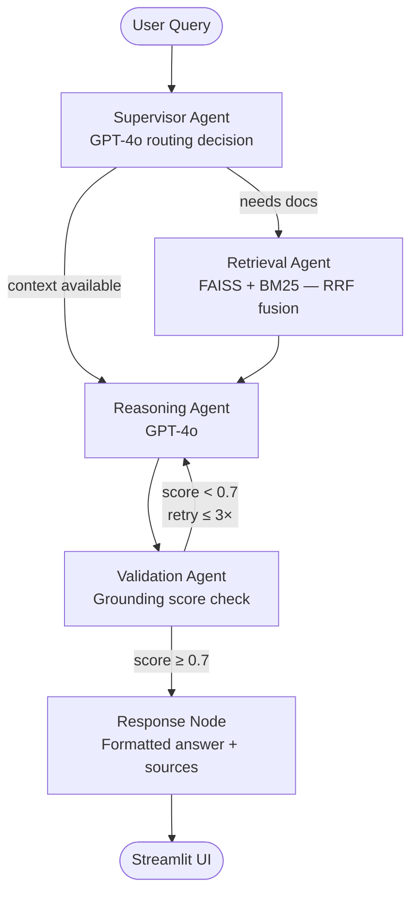

# Multi-Agent RAG System with LangGraph

<p align="center">
  
  
  
  
  
  
</p>

> **Agentic AI Orchestration over Financial Documents**  
> A supervisor-driven, hallucination-resistant Q&A system built with LangGraph, GPT-4o, and hybrid FAISS + BM25 retrieval.

---

## What This Does

Upload any financial earnings report (PDF) and ask questions in plain English:

- *"What was Apple's total revenue in Q4 FY2023?"*
- *"How did operating margins change year-over-year?"*
- *"What risks did management highlight in the earnings call?"*

The system retrieves only the relevant document chunks, generates a grounded answer using GPT-4o, then **automatically validates the answer** against its sources before returning it — preventing hallucinations from reaching the user.

---

## Architecture

A **Supervisor Agent** (GPT-4o) orchestrates three specialized sub-agents inside a [LangGraph](https://github.com/langchain-ai/langgraph) state machine:

| Agent | Responsibility |
|---|---|
| **Retrieval Agent** | Hybrid FAISS (dense) + BM25 (sparse) search with RRF fusion |
| **Reasoning Agent** | GPT-4o answer generation over retrieved context only |
| **Validation Agent** | Token-overlap grounding check; auto-retries if score < 0.7 |



### Shared Graph State

All agents read from and write to a single typed state object that flows through every node:

```python
class GraphState(TypedDict):
    query:            str
    chat_history:     Annotated[list[BaseMessage], operator.add]  # append-only
    retrieved_docs:   list[Document]
    sources:          list[str]
    reasoning_output: str
    validated_answer: str           # blank = retry needed
    validation_score: float         # 0.0 – 1.0
    next_agent:       str           # "retrieval" | "reasoning"
    retry_count:      int           # capped at max_retries (default 3)
    error:            Optional[str]
```

---

## Tech Stack

| Layer | Technology |
|---|---|
| Agent orchestration | LangGraph 0.2+ — explicit state machine with conditional edges |
| LLM (primary) | OpenAI GPT-4o |
| LLM (fallback) | GPT-3.5-turbo — automatic on GPT-4o failure |
| Embeddings | OpenAI `text-embedding-3-small` |
| Dense retrieval | FAISS (`faiss-cpu`) |
| Sparse retrieval | BM25 (`rank-bm25`) |
| Rank fusion | `EnsembleRetriever` — Reciprocal Rank Fusion, weights 0.6 / 0.4 |
| Tool validation | Pydantic v2 `BaseModel` as `args_schema` on every tool |
| Retry / backoff | `tenacity` — exponential backoff, 3 attempts |
| Observability | LangSmith — zero-instrumentation tracing via env vars |
| UI | Streamlit — chat interface with PDF upload sidebar |
| Config | Pydantic `BaseSettings` + `.env` |

---

## Project Structure

```
├── src/multi_agent_rag/
│   ├── config.py                  # Pydantic BaseSettings — all env vars typed
│   ├── agents/
│   │   ├── supervisor.py          # GPT-4o routing: "retrieval" vs "reasoning"
│   │   ├── retrieval_agent.py     # Calls hybrid_search tool, deduplicates sources
│   │   ├── reasoning_agent.py     # GPT-4o + tenacity retry + GPT-3.5 fallback
│   │   └── validation_agent.py    # Calls grounding_check tool, signals retry
│   ├── tools/
│   │   ├── search_tool.py         # @tool(args_schema=SearchInput) — FAISS + BM25
│   │   └── grounding_tool.py      # @tool(args_schema=GroundingInput) — token overlap
│   ├── graph/
│   │   ├── state.py               # GraphState TypedDict
│   │   ├── nodes.py               # 5 node functions wrapping each agent
│   │   ├── edges.py               # Conditional routing functions
│   │   └── builder.py             # StateGraph wiring + MemorySaver checkpointer
│   ├── vectorstore/
│   │   ├── ingestion.py           # PDF → text chunks → FAISS index + docs.pkl
│   │   └── retriever.py           # EnsembleRetriever builder (load or build)
│   └── utils/
│       ├── logger.py              # structlog structured logging
│       └── retry.py               # Shared tenacity config
├── app/
│   └── streamlit_app.py           # Chat UI — PDF upload, session history, sources
├── tests/
│   ├── conftest.py                # Shared mocks — no real API calls in tests
│   ├── test_agents.py
│   ├── test_graph.py
│   └── test_retrieval.py
├── data/sample_reports/           # Drop financial PDFs here before ingestion
├── notebooks/demo.ipynb           # End-to-end walkthrough notebook
├── .env.example                   # Config template (no secrets)
└── pyproject.toml                 # Project metadata + dependencies
```

---

## Key Design Decisions

### 1. Hybrid Search — FAISS + BM25 with RRF
Dense vector search (FAISS) captures semantic similarity; BM25 captures exact keyword matches — critical for financial data like ticker names, dates, and specific figures. Neither works well alone. **Reciprocal Rank Fusion** with weights `[0.6, 0.4]` merges both ranked lists: each document scores `1 / (rank + 60)` per list, then scores are summed. This consistently outperforms either retriever alone.

### 2. Validation & Retry Loop
After GPT-4o generates an answer, the validation agent computes **token-overlap precision** — the fraction of answer tokens that appear in the retrieved chunks. Scores below 0.7 signal potential hallucination and trigger re-reasoning (up to 3 retries). This is a lightweight, LLM-free confidence gate that is fully explainable.

### 3. Tool Schema Validation with Pydantic v2
Every tool declares a `BaseModel` as `args_schema`. LangChain validates all tool inputs against the schema before execution — type errors and missing fields are caught at the boundary, not mid-graph.

### 4. Retry at the LLM Call Level
`tenacity` is applied inside `_call_llm()` (not at the node level), so retries are transparent to LangGraph. After 3 failed GPT-4o calls, the reasoning node automatically falls back to GPT-3.5-turbo rather than propagating an error through the graph.

### 5. Multi-Turn Conversation via MemorySaver
`chat_history` uses the `operator.add` reducer — LangGraph **appends** new messages instead of overwriting. Combined with `MemorySaver` checkpointing keyed by `thread_id`, each chat session retains full context across turns.

### 6. Zero-Instrumentation Observability
Setting `LANGCHAIN_TRACING_V2=true` and `LANGCHAIN_API_KEY` is the only configuration needed. LangGraph propagates the tracing callback through every node automatically, giving full visibility in LangSmith without a single line of instrumentation code.

---

## LangSmith Trace — Example Run

```
▶ supervisor_node        12 ms    →  next_agent: "retrieval"
▶ retrieval_node        340 ms    →  5 chunks retrieved from Apple_10Q.pdf
▶ reasoning_node        1800 ms   →  GPT-4o answer generated
▶ validation_node          2 ms   →  score: 0.83 ✅  grounded
▶ response_node            1 ms   →  formatted answer + 2 source citations
```

---

## Setup

### Prerequisites

- Python **3.11, 3.12, or 3.13** (3.14+ not yet supported by ML dependencies)
- An OpenAI API key — [platform.openai.com/api-keys](https://platform.openai.com/api-keys)
- A LangSmith API key (free) — [smith.langchain.com](https://smith.langchain.com)

> **Windows users:** Install Python 3.12 via `winget install Python.Python.3.12`

### Installation

```bash
# 1. Clone the repository
git clone https://github.com/your-username/multi-agent-rag.git
cd multi-agent-rag

# 2. Create and activate a virtual environment
py -3.12 -m venv .venv
.venv\Scripts\activate            # Windows
# source .venv/bin/activate       # macOS / Linux

# 3. Install the package with all dependencies
pip install -e ".[dev]"
```

### Configure Environment Variables

```bash
copy .env.example .env            # Windows
# cp .env.example .env            # macOS / Linux
```

Open `.env` and fill in your keys:

```env
OPENAI_API_KEY=sk-...
LANGCHAIN_API_KEY=lsv2_sk_...
LANGCHAIN_TRACING_V2=true
LANGCHAIN_PROJECT=multi-agent-rag
```

All other values (`CHUNK_SIZE`, `TOP_K`, `GROUNDING_THRESHOLD`, etc.) are pre-configured with sensible defaults.

---

## Usage

### Step 1 — Ingest Documents (optional — or upload via UI)

Place PDF files in `data/sample_reports/`, then run:

```bash
python -m multi_agent_rag.vectorstore.ingestion
```

This splits PDFs into 800-token chunks, builds a FAISS vector index, and saves it to `faiss_index/`.

### Step 2 — Launch the App

```bash
streamlit run app/streamlit_app.py
```

Open [http://localhost:8501](http://localhost:8501).  
You can also upload PDFs directly from the sidebar — the index is built on the fly.

### Step 3 — Run Tests

```bash
pytest tests/ -v
```

All tests run **without a real OpenAI API key** — LLM calls are mocked via `unittest.mock`.

---

## Deployment

### Streamlit Community Cloud (recommended for demos)

1. Push this repo to GitHub (`.env` is gitignored — keys are never committed)
2. Go to [share.streamlit.io](https://share.streamlit.io) → New app → select this repo
3. Set **Main file**: `app/streamlit_app.py`
4. Add your keys under **Advanced settings → Secrets** (TOML format):
   ```toml
   OPENAI_API_KEY = "sk-..."
   LANGCHAIN_API_KEY = "lsv2_sk_..."
   LANGCHAIN_TRACING_V2 = "true"
   ```
5. Deploy — the app gets a public URL instantly

---

## Sample Reports for Testing

| Company | Report | Source |
|---|---|---|
| Apple | 10-Q FY2023 Q4 | [investor.apple.com](https://investor.apple.com/sec-filings/) |
| Microsoft | Annual Report FY2023 | [microsoft.com/investor](https://www.microsoft.com/en-us/investor) |
| Tesla | 10-Q Q3 2023 | [ir.tesla.com](https://ir.tesla.com) |

Download any of the above, place in `data/sample_reports/`, and run ingestion.

---

## License

MIT — see [LICENSE](LICENSE) for details.
